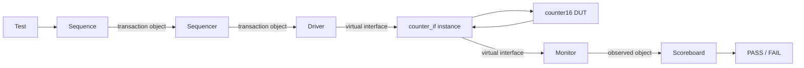

# Counter16 Verification

Đây là project verification bằng **SystemVerilog** cho một bộ đếm đồng bộ 16-bit (`counter16`). Cấu trúc project được tách theo kiểu một dự án thực tế để dễ học, dễ mở rộng và dễ quản lý về sau.

Project cố ý chứa **hai cách xây dựng testbench cho cùng một DUT**:

- `base_sv/`: testbench **class-based SystemVerilog** tự xây bằng `class`, `mailbox`, `virtual interface`.
- `uvm/`: cùng bài toán verification nhưng được tổ chức lại theo chuẩn **UVM (Universal Verification Methodology)** với `sequence`, `sequencer`, `driver`, `monitor`, `scoreboard`, `agent`, `env`, `test` và các kết nối TLM.

Mục tiêu chính không chỉ là làm cho counter chạy đúng, mà còn giúp nhìn rõ **dữ liệu đi từ Sequence đến DUT rồi quay về Scoreboard như thế nào**.

---

## 1. DUT là gì?

`DUT` = **Design Under Test** — khối RTL đang được kiểm tra.

Trong project này DUT nằm tại:

```text
rtl/counter16.sv
```

Counter có các tín hiệu:

| Signal | Hướng | Ý nghĩa |
|---|---|---|
| `clk` | input | Clock của counter |
| `reset` | input | Reset đồng bộ, active-high |
| `enable` | input | Cho phép counter tăng |
| `count[15:0]` | output | Giá trị đếm 16-bit |

Hành vi:

```text
reset = 1
    -> count = 16'h0000

reset = 0, enable = 1
    -> count tăng 1 ở mỗi posedge clk

reset = 0, enable = 0
    -> count giữ nguyên

16'hFFFF + 1
    -> 16'h0000
```

Tức counter chạy:

```text
0000 -> 0001 -> 0002 -> ... -> FFFE -> FFFF -> 0000 -> 0001 -> ...
```

Việc `FFFF -> 0000` được viết rõ trong RTL để hành vi wrap-around dễ đọc và dễ trình bày.

---

## 2. Kiến trúc verification tổng thể



Điểm quan trọng cần nhớ:

- **Sequence** tạo ra `transaction object` — chưa phải tín hiệu điện/logic đưa vào DUT.
- **Sequencer** quản lý và phân phối các transaction cho Driver.
- **Driver** là nơi chuyển `object -> signal`.
- **Interface** chứa các signal thật nối với DUT.
- **Virtual interface** chỉ là một `handle` để class như Driver/Monitor truy cập interface thật.
- **Monitor** làm chiều ngược lại: đọc signal và tạo ra object quan sát.
- **Scoreboard** tính giá trị đúng mong đợi (`expected`) rồi so với giá trị DUT thực sự tạo ra (`actual`).
- DUT hoàn toàn không biết `class`, `Sequence`, `UVM` hay `transaction` là gì. DUT chỉ nhìn thấy signal.

---

## 3. Interface và Virtual Interface

Interface thật nằm tại:

```text
common/counter_if.sv
```

Ở `tb_top`, interface được tạo thành một instance thật:

```systemverilog
counter_if intf();
```

Instance này thực sự chứa:

```text
intf.clk
intf.reset
intf.enable
intf.count
```

và được nối vào DUT.

Trong Driver hoặc Monitor lại dùng:

```systemverilog
virtual counter_if vif;
```

`vif` không tạo thêm một interface mới. Nó chỉ là **handle/reference** trỏ tới interface thật `intf`.

Có thể hình dung:

```text
Driver class
    |
    | virtual interface (vif)
    v
counter_if intf   <- interface thật
    |
    v
counter16 DUT
```

Project còn dùng `clocking block` (`drv_cb`, `mon_cb`) để giảm nguy cơ race condition giữa Driver, DUT và Monitor.

---

## 4. Cấu trúc thư mục

```text
counter16_verification/
|
|-- README.md
|
|-- rtl/
|   `-- counter16.sv
|
|-- common/
|   `-- counter_if.sv
|
|-- base_sv/
|   |-- counter_transaction.sv
|   |-- counter_sample.sv
|   |-- counter_generator.sv
|   |-- counter_driver.sv
|   |-- counter_monitor.sv
|   |-- counter_scoreboard.sv
|   |-- counter_clock_gen.sv
|   |-- counter_reset_gen.sv
|   |-- counter_env.sv
|   |-- counter_test.sv
|   |-- counter_base_pkg.sv
|   |-- tb_top.sv
|   |-- filelist.f
|   `-- run_questa.do
|
|-- uvm/
|   |-- counter_item.sv
|   |-- counter_sequences.sv
|   |-- counter_sequencer.sv
|   |-- counter_driver.sv
|   |-- counter_monitor.sv
|   |-- counter_scoreboard.sv
|   |-- counter_agent.sv
|   |-- counter_env.sv
|   |-- counter_tests.sv
|   |-- counter_uvm_pkg.sv
|   |-- tb_top.sv
|   |-- filelist.f
|   `-- run_questa.do
|
|-- sanity/
|   `-- counter16_rtl_tb.sv
|
|-- scripts/
|   |-- run_base_questa.bat
|   |-- run_base_wrap_questa.bat
|   |-- run_uvm_questa.bat
|   `-- run_uvm_wrap_questa.bat
|
|-- diagrams/
|   |-- 01_overall_architecture.mmd
|   |-- 02_base_sv_mailbox.mmd
|   |-- 03_uvm_sequence_driver.mmd
|   `-- 04_interface_vs_virtual_interface.mmd
|
|-- docs/
|   |-- architecture.md
|   `-- demo_questions.md
|
`-- .github/workflows/
    `-- rtl-sanity.yml
```

---

## 5. Base SystemVerilog hoạt động như thế nào?

Phiên bản `base_sv/` giúp nhìn thấy cơ chế bên dưới trước khi UVM chuẩn hóa nó.

Luồng dữ liệu:

```text
counter_generator
      |
      | counter_transaction object
      v
 gen2drv mailbox
      |
      v
counter_driver
      |
      | virtual interface
      v
 counter_if
      |
      v
 counter16 DUT
      |
      v
 counter_if
      |
      v
counter_monitor
      |
      | counter_sample object
      v
 mon2sb mailbox
      |
      v
counter_scoreboard
      |
      v
 PASS / FAIL
```

### `counter_transaction`

Là object mô tả stimulus cần đưa vào DUT.

Ví dụ:

```text
enable = 1
```

Transaction vẫn chỉ là object trong testbench.

### `mailbox`

`mailbox` có thể hiểu như một hộp thư/hàng đợi để các class trao đổi object.

```text
Generator --put()--> mailbox --get()--> Driver
```

Base-SV còn có ACK từ Driver về Generator để bảo đảm một transaction tương ứng với một chu kỳ DUT đã thực sự xử lý, thay vì Generator gửi transaction nhanh hơn clock.

### `counter_driver`

Driver nhận transaction rồi chuyển thành signal:

```text
transaction.enable
       |
       v
vif.enable
       |
       v
DUT
```

Đây chính là điểm **object -> signal**.

### `counter_monitor`

Monitor không điều khiển DUT. Nó chỉ quan sát:

```text
DUT signal
    |
    v
counter_if
    |
    v
Monitor
    |
    v
counter_sample object
```

Đây chính là điểm **signal -> object**.

### `counter_scoreboard`

Scoreboard tự mô hình hóa counter đúng:

```text
reset  -> expected = 0000
enable -> expected = expected + 1
disable -> expected giữ nguyên
FFFF + 1 -> 0000
```

Sau đó:

```text
expected == actual -> PASS
expected != actual -> FAIL
```

### Clock và Reset

Trong Base-SV, `clock` và `reset` được cố ý tách thành class riêng:

```text
counter_clock_gen
counter_reset_gen
```

Việc tách này phục vụ mục tiêu học và đúng với yêu cầu bài tập: thấy rõ từng trách nhiệm trong testbench.

---

## 6. UVM hoạt động như thế nào?

UVM không thay đổi bản chất bài toán. Nó chuẩn hóa cách tổ chức các thành phần verification.

Luồng chính:

```text
uvm_test
   |
   v
uvm_sequence
   |
   | counter_item
   v
counter_sequencer
   |
   | seq_item_port / seq_item_export
   v
counter_driver
   |
   | virtual counter_if
   v
counter16 DUT
   |
   v
counter_monitor
   |
   | analysis_port
   v
counter_scoreboard
```

### Sequence

`Sequence` tạo ra các `sequence item` (transaction của UVM).

Ví dụ một item có thể chứa:

```text
reset  = 0
enable = 1
```

### Sequencer

`Sequencer` đứng giữa Sequence và Driver.

Nó quản lý việc cấp item cho Driver và có thể xử lý nhiều Sequence cạnh tranh tài nguyên trong các test phức tạp hơn.

### Driver

Driver lấy item bằng cơ chế UVM:

```systemverilog
seq_item_port.get_next_item(req);
... drive DUT ...
seq_item_port.item_done();
```

Kết nối giữa Driver và Sequencer:

```systemverilog
driver.seq_item_port.connect(
    sequencer.seq_item_export
);
```

### Monitor -> Scoreboard

Monitor gửi object quan sát bằng `analysis_port`.

```text
Monitor
   |
   | analysis_port
   v
Scoreboard
```

Scoreboard không nên lấy trực tiếp dữ liệu từ Sequence vì nó cần kiểm tra **DUT thực sự làm gì**, không phải testbench định yêu cầu DUT làm gì.

### Agent

`counter_agent` gom:

```text
Sequencer
Driver
Monitor
```

### Environment

`counter_env` chứa:

```text
counter_agent
counter_scoreboard
```

### Test

`uvm_test` là tầng trên cùng quyết định Sequence nào sẽ chạy.

---

## 7. Mapping Base-SV sang UVM

| Vai trò | Base SystemVerilog | UVM |
|---|---|---|
| Stimulus object | `counter_transaction` | `counter_item extends uvm_sequence_item` |
| Tạo stimulus | `counter_generator` | `uvm_sequence` |
| Chuyển item tới Driver | `mailbox` | `sequencer + seq_item_port/export` |
| Drive DUT | `counter_driver` | `counter_driver extends uvm_driver` |
| Quan sát DUT | `counter_monitor` | `counter_monitor extends uvm_monitor` |
| Kiểm tra | `counter_scoreboard` | `counter_scoreboard extends uvm_scoreboard` |
| Gom thành phần | `counter_env` | `counter_env extends uvm_env` |
| Kịch bản test | `counter_test` | `uvm_test` |

Đây là phần quan trọng nhất khi học: UVM không tạo ra một bài toán hoàn toàn mới; UVM chuẩn hóa những thứ đã có trong class-based SystemVerilog.

---

## 8. Các testcase hiện có

### Base SystemVerilog

Smoke test mặc định kiểm tra:

- reset ban đầu;
- counter tăng khi `enable=1`;
- giữ nguyên khi `enable=0`;
- tăng trở lại;
- reset giữa khi đang chạy;
- reset có ưu tiên đúng.

Wrap test:

```text
... -> FFFE -> FFFF -> 0000 -> 0001 -> 0002
```

Wrap test thực sự chạy qua toàn bộ miền 16-bit, không ép trực tiếp giá trị nội bộ DUT.

### UVM

Có hai test:

```text
counter_smoke_test
counter_wrap_test
```

`counter_smoke_test` kiểm tra các chức năng cơ bản.

`counter_wrap_test` chạy regression đầy đủ để kiểm tra wrap-around 16-bit.

---

## 9. RTL Sanity CI

`sanity/counter16_rtl_tb.sv` là testbench RTL đơn giản, độc lập với class-based SV và UVM.

GitHub Actions sử dụng **Icarus Verilog** để kiểm tra:

- compile RTL;
- reset;
- hold;
- toàn bộ miền đếm 16-bit;
- `FFFF -> 0000`;
- tăng sau wrap;
- hold sau wrap.

Workflow:

```text
.github/workflows/rtl-sanity.yml
```

Lưu ý:

> CI này xác minh RTL sanity. Nó không có nghĩa full UVM environment đã được compile bằng Icarus.

Full UVM nên chạy bằng simulator có hỗ trợ UVM như **Questa/ModelSim** phù hợp.

---

## 10. Chạy project bằng Questa trên Windows

Đảm bảo `vsim` và `vlog` đã có trong `PATH`.

### Base-SV smoke test

```bat
scripts\run_base_questa.bat
```

### Base-SV full wrap test

```bat
scripts\run_base_wrap_questa.bat
```

### UVM smoke test

```bat
scripts\run_uvm_questa.bat
```

### UVM full wrap test

```bat
scripts\run_uvm_wrap_questa.bat
```

Đối với UVM, đặt biến môi trường `UVM_HOME` tới thư mục chứa:

```text
src/uvm_pkg.sv
src/uvm_macros.svh
```

Script `uvm/run_questa.do` sẽ compile UVM source với `UVM_NO_DPI`, sau đó compile project.

---

## 11. Compile order

### Base SystemVerilog

`base_sv/filelist.f`:

```text
1. common/counter_if.sv
2. rtl/counter16.sv
3. base_sv/counter_base_pkg.sv
4. base_sv/tb_top.sv
```

`counter_base_pkg.sv` include các class Base-SV.

### UVM

`uvm/filelist.f`:

```text
1. UVM library/package
2. common/counter_if.sv
3. rtl/counter16.sv
4. uvm/counter_uvm_pkg.sv
5. uvm/tb_top.sv
```

`counter_uvm_pkg.sv` include các class UVM của project.

---

## 12. Timing Driver - DUT - Monitor

Project chọn luồng timing:

```text
negedge clk
    |
    +--> Driver thay reset/enable
              |
              v
posedge clk
    |
    +--> DUT sample reset/enable và cập nhật count
              |
              v
negedge clk tiếp theo
    |
    +--> Monitor sample kết quả
```

Cách bố trí này giúp tránh Driver và Monitor cùng tranh chấp/sampling signal sai thời điểm.

---

## 13. Các sơ đồ Mermaid

Các file sơ đồ editable nằm tại:

```text
diagrams/01_overall_architecture.mmd
diagrams/02_base_sv_mailbox.mmd
diagrams/03_uvm_sequence_driver.mmd
diagrams/04_interface_vs_virtual_interface.mmd
```

Có thể mở bằng Mermaid extension trong VS Code hoặc import nội dung sang draw.io.

---

## 14. Những câu cần tự trả lời khi demo

Bạn nên tự trả lời được các câu sau mà không cần đọc code:

1. `DUT` là gì?
2. Sequence tạo và gửi cái gì?
3. Transaction object có đi xuyên qua DUT không?
4. Sequence khác Sequencer ở đâu?
5. Sequencer đưa gì cho Driver?
6. `seq_item_port` và `seq_item_export` dùng để làm gì?
7. Tại sao Driver không nối trực tiếp class vào port DUT?
8. `interface` khác `virtual interface` như thế nào?
9. Object được chuyển thành signal ở đâu?
10. Signal được đóng gói trở lại object ở đâu?
11. Monitor có được phép drive DUT không?
12. Tại sao Scoreboard lấy dữ liệu từ Monitor chứ không lấy trực tiếp từ Sequence?
13. Agent chứa những thành phần nào?
14. Environment (`env`) dùng để làm gì?
15. Khi `count = 16'hFFFF`, cạnh đếm tiếp theo xảy ra chuyện gì?

Danh sách Q&A ngắn hơn nằm tại:

```text
docs/demo_questions.md
```

---

## 15. Câu tóm tắt toàn bộ project

Có thể mô tả toàn bộ project bằng một câu:

> **Sequence tạo transaction object -> Sequencer cấp object cho Driver -> Driver biến object thành signal qua virtual interface/interface -> DUT xử lý signal -> Monitor đọc output signal và đóng gói thành object -> Scoreboard so sánh actual với expected để kết luận PASS/FAIL.**

Đây là luồng cốt lõi cần hiểu trước khi đi sâu hơn vào UVM.