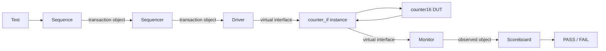

# Counter16 Verification

A small but production-shaped SystemVerilog verification project for a 16-bit synchronous counter. The repository deliberately contains **two testbench implementations around the same DUT**:

- `base_sv/`: class-based SystemVerilog built manually with typed mailboxes.
- `uvm/`: the same verification intent mapped to standard UVM components and TLM connections.

The project is intended to make the architecture understandable before hiding the mechanics behind UVM.

## DUT behavior

`rtl/counter16.sv` implements:

- 16-bit `count` output.
- synchronous active-high `reset`.
- increment on each rising edge when `enable=1`.
- hold when `enable=0`.
- explicit wrap `16'hFFFF -> 16'h0000` on the next enabled rising edge.

## Architecture



The key boundary is the driver/monitor pair:

- **Driver:** object -> pin-level signals.
- **Monitor:** pin-level signals -> observed object.
- The DUT never sees a class object or UVM component.

See `docs/architecture.md` and the editable Mermaid sources under `diagrams/`.

## Repository layout

```text
rtl/        counter16 DUT
common/     shared signal interface
base_sv/    class-based SystemVerilog implementation
uvm/        UVM implementation
sanity/     dependency-light RTL regression
scripts/    Windows/Questa launchers
diagrams/   Mermaid architecture sources
docs/       explanation and demo questions
.github/    RTL sanity CI
```

## Base SystemVerilog data flow

```text
counter_generator
      |
      | counter_transaction object
      v
 gen2drv mailbox
      |
      v
counter_driver
      |
      | virtual interface -> real signals
      v
 counter_if -> DUT
                 |
                 v
             counter_if
                 |
                 v
          counter_monitor
                 |
                 | counter_sample object
                 v
           mon2sb mailbox
                 |
                 v
        counter_scoreboard
```

Clock and reset are intentionally separate classes in the Base-SV version so their responsibilities are visible.

## UVM data flow

```text
uvm_test
  -> uvm_sequence
  -> counter_sequencer
  -> counter_driver.seq_item_port
  -> virtual counter_if
  -> counter16 DUT
  -> counter_monitor
  -> analysis_port
  -> counter_scoreboard
```

`counter_agent` owns the sequencer, driver and monitor. `counter_env` owns the agent and scoreboard.

## Tests

### Base SV

- default smoke test: reset, increment, hold, increment, mid-test reset.
- `+WRAP`: full 16-bit wrap regression through `FFFF -> 0000`.

### UVM

- `counter_smoke_test`: reset + basic functional scenarios + mid-test reset.
- `counter_wrap_test`: full 16-bit wrap regression.

### RTL sanity CI

`sanity/counter16_rtl_tb.sv` is deliberately independent of the class/UVM testbenches. GitHub Actions compiles it with Icarus Verilog and checks reset, hold, the complete 16-bit count range, wrap-around and post-wrap hold behavior.

This CI proves the RTL sanity test. It does **not** claim to compile the full UVM environment; the UVM regression is intended for a simulator with UVM support such as Questa.

## Run with Questa on Windows

Ensure `vsim`/`vlog` are on `PATH`.

Base smoke:

```bat
scripts\run_base_questa.bat
```

Base full wrap:

```bat
scripts\run_base_wrap_questa.bat
```

UVM smoke:

```bat
scripts\run_uvm_questa.bat
```

UVM wrap:

```bat
scripts\run_uvm_wrap_questa.bat
```

For UVM, set `UVM_HOME` to the UVM installation directory that contains `src/uvm_pkg.sv` and `src/uvm_macros.svh`. The supplied `.do` script compiles that package with `UVM_NO_DPI`, then compiles the project. This avoids depending on a simulator-specific precompiled UVM library name.

## Compile order

Base SV (`base_sv/filelist.f`):

1. `common/counter_if.sv`
2. `rtl/counter16.sv`
3. `base_sv/counter_base_pkg.sv` (includes all Base-SV classes)
4. `base_sv/tb_top.sv`

UVM (`uvm/filelist.f`):

1. UVM library/package supplied by the simulator
2. `common/counter_if.sv`
3. `rtl/counter16.sv`
4. `uvm/counter_uvm_pkg.sv` (includes all UVM classes)
5. `uvm/tb_top.sv`

## What to explain in a review/demo

You should be able to explain these points without reading code:

1. A sequence creates **transaction objects**, not electrical signals.
2. In UVM the sequencer sits between sequence and driver; the driver uses `seq_item_port`/`seq_item_export` to receive items.
3. The driver turns an item into `reset`/`enable` signals.
4. `counter_if intf()` is the real interface instance; `virtual counter_if vif` is only a handle used by a class to access it.
5. The monitor observes DUT signals and creates a new observed object.
6. The scoreboard models the expected count and compares it with the observed `count`.

A compact Q&A list is in `docs/demo_questions.md`.
